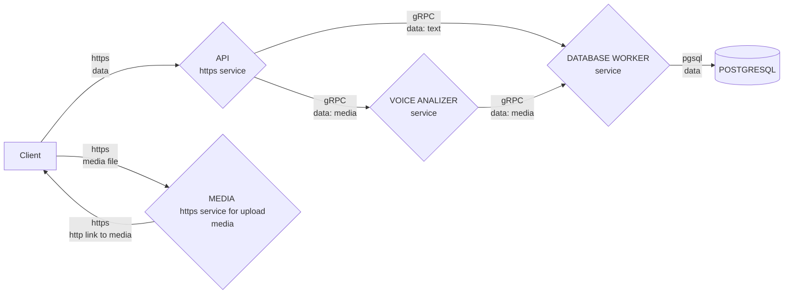

# YpotaCaht
Это познавательно-развлекательный сервис способствующий более лучшему пониманию взаимодействия С++ и человека.

#### Описание модели сервиса



#### Техническое описание модели проекта
1. Взаимодействие между клиентом и сервисом осуществляется по https протоколу эмитирующего gRPC:
	 - все запросы - POST.
	 - в заголовке запроса нужно указать ИМЯ ФУНКЦИИ для ее вызова на стороне сервера и токен.
	 - в теле запроса нужно указать параметры (если они необходимы) для этой функции.
   
   пример запроса:
    ```js
    const axios = require('axios');
    let data = JSON.stringify({
      "key": "test",
      "key_int": 123
    });

    let config = {
      method: 'post',
      maxBodyLength: Infinity,
      url: 'http://localhost:5000/api',
      headers: { 
        'TRS-server-function': 'healthcheck', 
        'TRS-server-token': 'token_super_secret', 
        'Content-Type': 'application/json'
      },
      data : data
    };
    ```

2. При получении запроса, сервис отдает его инспектору, который проверяет зарегестрированна ли такая функция в системе и валидирует прикрепленные к запросу параметры.
3. Если все отлично, то сервис формирует gRPC запрос к нужному сервису. Если нет, возвращает клиенту ошибку.
4. Далее происходит работа отдельного сервиса согласно его назначению (см. ниже)


#### Краткое назначение папок проекта:
- ***bin*** - файл на выполнение.

- ***src*** - сорцы проекта.

- ***subprojects*** - данная папка является частью meson build system и туда подтягиваются все библиотеки сторонних разработчиков.

- ***src/libs*** - данная папка содержит разные библиотеки(части проекта), нами же написанные, которые в последствии можно использовать отдельно в других проектах.
(в общем-то так оно и есть - эти либы подтягиваются, как отдельные зависимости и распологаются в папке subprojects, но тут они расположены для отображения общей картины и чтения кода.)

- ***src/libs/http*** - обертка над [httplib](https://github.com/yhirose/cpp-httplib) для работы с https запросами к сервису.

- ***src/api*** - расположены проверяющие функции и функции идущие на выполнение.


#### Вопросы
- А нужна ли тут при расчитынах нами нагрузках и такой реализации сервиса штука gRPC?

